# Design System: Student-First College Digital Hub

**Version:** 1.0.0  
**Design Lead & Frontend Architect:** Senior Product Designer & Frontend Design-System Engineer  
**Aesthetic Direction:** Modern Academic Portal • Clean Productivity Interface • High Contrast & Legibility • Trustworthy & Approachable  

---

## 1. Visual Personality & Design Philosophy

The Student Hub design system is engineered around the operational reality of college life: fast, high-frequency, task-oriented interactions under varied lighting conditions, predominantly on mobile screens.

### Core Principles
- **Modern Academic:** Avoids archaic crests, faux-parchment textures, and generic corporate SaaS aesthetics. Delivers a clean, authoritative, and contemporary look.
- **Glanceable & Ergonomic:** High information density where necessary, paired with clean whitespace and progressive disclosure to prevent cognitive fatigue.
- **Purposeful Palette:** Controlled use of color. Color indicates status, priority, or action—never mere decoration.
- **Tactile Precision:** Generous touch targets ($\ge 44\text{px}$), crisp borders ($1\text{px}$ slate lines), and subtle elevations ($2\text{px} - 16\text{px}$ soft ambient shadows).
- **Universal Accessibility:** WCAG 2.2 Level AA compliance built directly into contrast ratios, keyboard navigation paths, visible focus rings, and screen-reader landmark labeling.

---

## 2. Typography System

The typography system relies on a high-clarity sans-serif stack utilizing native system rendering engines for zero network lag and optimal sub-pixel sharpness across Retina, AMOLED, and LCD screens.

### Font Family Stack
```css
--font-family-sans: -apple-system, BlinkMacSystemFont, "Segoe UI", Roboto, "Inter", "Helvetica Neue", Arial, sans-serif;
--font-family-mono: ui-monospace, SFMono-Regular, Menlo, Monaco, Consolas, "Liberation Mono", monospace;
```

### Type Scale & Hierarchy

| Token | Size (rem / px) | Weight | Line Height | Letter Spacing | Semantic Role |
|---|---|---|---|---|---|
| `--text-display` | 2.0rem (32px) | 700 (Bold) | 1.2 | -0.025em | Major hub hero headings |
| `--text-h1` | 1.625rem (26px) | 700 (Bold) | 1.25 | -0.02em | Primary page title |
| `--text-h2` | 1.25rem (20px) | 600 (Semibold) | 1.35 | -0.01em | Section headers & widget titles |
| `--text-h3` | 1.0625rem (17px) | 600 (Semibold) | 1.4 | -0.005em | Card headlines & group titles |
| `--text-body` | 0.9375rem (15px) | 400 (Regular) | 1.5 | 0 | Default body text & descriptions |
| `--text-body-medium`| 0.9375rem (15px) | 500 (Medium) | 1.5 | 0 | Emphasized content & list items |
| `--text-small` | 0.8125rem (13px) | 400 / 500 | 1.4 | +0.005em | Secondary labels, supporting info |
| `--text-label` | 0.75rem (12px) | 600 (Semibold) | 1.3 | +0.02em | Form labels, category badges |
| `--text-meta` | 0.6875rem (11px) | 600 (Semibold) | 1.2 | +0.04em | Reference numbers, timestamps, tags |

---

## 3. Color System & Semantic Tokens

All color tokens are calibrated to satisfy WCAG 2.2 AA contrast requirements (minimum 4.5:1 for body copy; 3:1 for large text and interactive boundaries).

### Palette Architecture

```mermaid
graph TD
    A["Color Token System"] --> B["Surfaces & Backgrounds"]
    A --> C["Text & Content"]
    A --> D["Brand & Primary Actions"]
    A --> E["Status & Feedback (Semantic)"]
    A --> F["Borders & Dividers"]

    B --> B1["--color-bg (Soft Slate #f8fafc)"]
    B --> B2["--color-surface (Crisp White #ffffff)"]
    B --> B3["--color-surface-elevated (Card #ffffff)"]
    B --> B4["--color-surface-subtle (#f1f5f9)"]

    C --> C1["--color-text-primary (Deep Slate #0f172a)"]
    C --> C2["--color-text-secondary (#475569)"]
    C --> C3["--color-text-muted (#64748b)"]

    D --> D1["--color-primary (Oxford Blue #1a56db)"]
    D --> D2["--color-primary-hover (#1e429f)"]
    D --> D3["--color-primary-subtle (#eff6ff)"]

    E --> E1["Danger / Urgent (Crimson #b91c1c / #fef2f2)"]
    E --> E2["Warning / Deadline (Amber #b45309 / #fffbeb)"]
    E --> E3["Success / Clearance (Emerald #047857 / #ecfdf5)"]
    E --> E4["Info / Circulars (Blue #1d4ed8 / #eff6ff)"]
```



### Semantic Token Specifications

| Token | Hex Value | Contrast against Surface | Role / Usage |
|---|---|---|---|
| `--color-bg` | `#f8fafc` | N/A | Base viewport canvas background |
| `--color-surface` | `#ffffff` | N/A | Primary card, container, and dialog surface |
| `--color-surface-elevated`| `#ffffff` | N/A | Floating menus, modals, toasts |
| `--color-surface-subtle` | `#f1f5f9` | N/A | Table alternating rows, code blocks, chips |
| `--color-text-primary` | `#0f172a` | **15.8:1** (AAA) | High-contrast headings and primary reading copy |
| `--color-text-secondary` | `#475569` | **7.5:1** (AAA) | Descriptions, metadata, secondary body |
| `--color-text-muted` | `#64748b` | **4.6:1** (AA) | Timestamps, inactive states, subtle labels |
| `--color-border` | `#e2e8f0` | 3.1:1 | Structural separators, card borders |
| `--color-border-subtle` | `#cbd5e1` | 3.5:1 | Input outlines, active borders |
| `--color-primary` | `#1a56db` | 5.2:1 (AA) | Primary buttons, active tabs, brand accents |
| `--color-primary-hover` | `#1e429f` | 6.8:1 (AAA) | Hover and press states for primary controls |
| `--color-primary-subtle` | `#eff6ff` | N/A | Selected tab background, active pill fill |
| `--color-danger` | `#b91c1c` | 5.4:1 (AA) | Critical alerts, overdue deadlines, destructive |
| `--color-danger-subtle` | `#fef2f2` | N/A | Urgent banner background, error badge fill |
| `--color-warning` | `#b45309` | 4.9:1 (AA) | Impending deadlines, cautionary circulars |
| `--color-warning-subtle` | `#fffbeb` | N/A | Deadline warning badge fill, notice highlights |
| `--color-success` | `#047857` | 5.1:1 (AA) | Cleared courses, approved requests, normal status|
| `--color-success-subtle` | `#ecfdf5` | N/A | Approved badge fill, attendance success pill |
| `--color-info` | `#1d4ed8` | 5.3:1 (AA) | Informational notices, academic calendar items |
| `--color-info-subtle` | `#eff6ff` | N/A | Info card background, category badges |

---

## 4. Spacing Scale

The spacing system is rooted in a mathematically harmonious $4\text{px}$ linear grid:

| Token | Dimension (rem / px) | Typical Use |
|---|---|---|
| `--space-0` | `0` | Reset / margin collapse |
| `--space-1` | `0.25rem` (4px) | Tight icon-to-text spacing, micro badge padding |
| `--space-2` | `0.5rem` (8px) | Button icon gap, chip padding, row vertical gap |
| `--space-3` | `0.75rem` (12px)| Compact card padding, form input inner padding |
| `--space-4` | `1.0rem` (16px) | Standard component padding, list item gutters |
| `--space-5` | `1.25rem` (20px)| Card internal padding, medium gaps |
| `--space-6` | `1.5rem` (24px) | Section separation, container horizontal padding |
| `--space-8` | `2.0rem` (32px) | Macro layout vertical rhythm, dashboard grid gap|
| `--space-10`| `2.5rem` (40px) | Page header bottom margin |
| `--space-12`| `3.0rem` (48px) | Major division separation |

---

## 5. Border Radius System

Corner radii provide a balanced, contemporary feel without playful over-rounding:

| Token | Dimension | Applied Elements |
|---|---|---|
| `--radius-none` | `0px` | Strict linear dividers |
| `--radius-xs` | `4px` | Small tags, code blocks, reference badges |
| `--radius-sm` | `6px` | Status badges, category chips, tooltips |
| `--radius-md` | `8px` | Buttons, form inputs, select dropdowns, search bar |
| `--radius-lg` | `12px` | Cards, schedule widgets, alert banners |
| `--radius-xl` | `16px` | Modal dialogs, bottom sheets, search overlays |
| `--radius-full`| `9999px` | Avatars, notification pill counters, radio dots |

---

## 6. Shadow & Elevation System

Shadows follow natural directional lighting with subtle ambient occlusion rather than harsh blurry dark smears:

| Token | CSS Definition | Purpose |
|---|---|---|
| `--elevation-0` | `none` | Flat elements, subtle borders |
| `--elevation-1` | `0 1px 3px 0 rgba(15, 23, 42, 0.06), 0 1px 2px -1px rgba(15, 23, 42, 0.04)` | Resting cards, action tiles, buttons |
| `--elevation-2` | `0 4px 6px -1px rgba(15, 23, 42, 0.08), 0 2px 4px -2px rgba(15, 23, 42, 0.04)` | Hover states, dropdown menus, sticky headers |
| `--elevation-3` | `0 10px 15px -3px rgba(15, 23, 42, 0.08), 0 4px 6px -4px rgba(15, 23, 42, 0.03)` | Toasts, popovers, quick action flyouts |
| `--elevation-4` | `0 20px 25px -5px rgba(15, 23, 42, 0.12), 0 8px 10px -6px rgba(15, 23, 42, 0.04)` | Modal dialogs, search command palette |
| `--shadow-focus`| `0 0 0 3px rgba(26, 86, 219, 0.25)` | Accessible keyboard focus ring |

---

## 7. Unified Iconography System

To ensure absolute visual coherence:
- **Geometry:** Uniform $24 \times 24$ bounding box (`viewBox="0 0 24 24"`).
- **Stroke Width:** $1.75\text{px}$ to $2.0\text{px}$ standard.
- **Terminals:** `stroke-linecap="round"` and `stroke-linejoin="round"`.
- **Delivery:** Centralized SVG generator module ([`js/icons.js`](file:///d:/geetha%20prasad/js/icons.js)) rendering identical stroke weights across all views.
- **Accessibility:** All decorative icons include `aria-hidden="true"`. Standalone interactive icons feature explicit `aria-label` tags.

---

## 8. Reusable Component Specifications

### 8.1 Header & Page Header
- **App Header:** Sticky $60\text{px}$ navigation bar with institutional branding, instant omni-search trigger (`Ctrl+K`), notification bell, and student avatar pill.
- **Page Header:** Structured layout with breadcrumb trail, page $H1$, contextual description, and contextual action buttons (e.g., "Download PDF", "Filter").

### 8.2 Navigation & Mobile Navigation
- **Desktop Navigation:** Horizontal link bar with active pill indicators and bottom accent line.
- **Mobile Bottom Navigation:** $64\text{px}$ bar fixed to thumb-reach zone with 5 core anchors: Home, Notices, Academics, Exams, Services.

### 8.3 Buttons & Icon Buttons
- **Variants:**
  - `btn--primary`: Solid blue (`#1a56db`), white text.
  - `btn--secondary`: Subtle slate background (`#f1f5f9`), slate text.
  - `btn--outline`: 1px slate border (`#cbd5e1`), white background.
  - `btn--ghost`: Transparent, hover highlight.
  - `btn--danger`: Solid crimson (`#b91c1c`) for critical or cancellation actions.
- **Sizes:** Small ($32\text{px}$ height), Medium ($40\text{px}$ height), Large ($48\text{px}$ height).
- **States:** Default, Hover, Active (spring down $0.98$), Focus-visible (blue halo), Disabled ($50\%$ opacity).

### 8.4 Cards (Notice, Event, Deadline, Quick Action)
- **Notice Card:** Includes category badge, reference number, date, clear title, summary, and action link.
- **Event Card:** Features split date badge (Month + Date), event name, venue, organizer, and RSVP button.
- **Deadline Card:** Highlighted countdown tag (`Due in 3 days`), course name, and submission action.
- **Quick-Action Tile:** Tactile card with rounded icon circle, bold action label, and micro-description.

### 8.5 Badges & Status Indicators
- **Badges:** Neutral, Primary, Success, Warning, Danger, Info with text and subtle background.
- **Status Indicator:** Glowing or solid dot paired with status text (`Active`, `Scheduled`, `Under Review`).

### 8.6 Tabs & Breadcrumbs
- **Tabs:** ARIA compliant (`role="tablist"` / `role="tab"` / `role="tabpanel"`), arrow-key navigable.
- **Breadcrumbs:** Structured hierarchical trail (`Home / Academics / Timetable`) with accessible chevron separators.

### 8.7 Empty States & Loading States
- **Empty State:** Centered container with clean SVG line illustration, heading, descriptive text, and a primary recovery CTA.
- **Loading Skeleton:** Pulsing neutral shimmer blocks representing cards, titles, and text rows to eliminate layout shifts (CLS).

### 8.8 Modal, Drawer & Form Controls
- **Modal Dialog:** Accessible `<dialog>` overlay with focus trapping, `Escape` key support, and backdrop blur.
- **Form Controls:** Clean input fields, styled selects, textareas, checkboxes, and toggle switches with active focus rings, helper text, and validation error messaging.

### 8.9 Toast Notification System
- Toast container fixed at top-right on desktop / bottom-center on mobile.
- Programmatic API: `window.showToast({ type: 'success' | 'info' | 'warning' | 'error', title, message, duration })`.

---

## 9. Responsive Breakpoints & Fluid Grid

| Breakpoint Name | Media Query Range | Container Width | Layout Strategy |
|---|---|---|---|
| **Mobile** | $< 640\text{px}$ | $100\%$ ($16\text{px}$ gutters) | 1-column stack, sticky bottom navigation, header compact |
| **Tablet** | $640\text{px} - 1024\text{px}$ | Max $720\text{px}$ - $960\text{px}$ | 2-column grid for action tiles & card splits |
| **Desktop** | $1024\text{px} - 1280\text{px}$| Max $1160\text{px}$ | Full top nav, 2-column dashboard (1.4fr : 1fr) |
| **Large Desktop** | $> 1280\text{px}$ | Max $1240\text{px}$ centered | Optimized readable line length, generous macro spacing |

---

## 10. Accessibility (a11y) Verification Standards

1. **WCAG 2.2 AA Contrast Compliance:** All text tokens tested against their respective surface tokens.
2. **Keyboard Navigation:** Every interactive element has a visible, high-contrast `:focus-visible` state.
3. **Screen Reader Support:** Semantic HTML5 landmarks (`header`, `nav`, `main`, `section`, `dialog`), `aria-live` for toasts and search results, `aria-expanded` and `aria-current` for navigation states.
4. **Motion Preferences:** `@media (prefers-reduced-motion: reduce)` zeroes out transition durations.
5. **Touch Ergonomics:** All clickable elements maintain a minimum hit area of $44 \times 44\text{px}$ on touch viewports.
