# Information Architecture & Navigation Taxonomy

## 1. Architectural Philosophy

The Information Architecture (IA) for the **Student-First College Digital Hub** flips the legacy model upside-down:
- **Legacy Model:** Structured around the college's administrative hierarchy (Chancellor $\rightarrow$ Registrar $\rightarrow$ Academic Council $\rightarrow$ Faculty $\rightarrow$ Departments $\rightarrow$ Circulars).
- **Student-First Model:** Structured around the student's daily cognitive and operational tasks (Urgent Info $\rightarrow$ Schedule & Courses $\rightarrow$ Assessments & Results $\rightarrow$ Administrative Services $\rightarrow$ Campus Life).

```mermaid
graph TD
    A["Digital Hub Core"] --> B["1. HOME (Dashboard)"]
    A --> C["2. NOTICES"]
    A --> D["3. ACADEMICS"]
    A --> E["4. EXAMS"]
    A --> F["5. CAMPUS"]
    A --> G["6. STUDENT SERVICES"]
    A --> H["7. SEARCH (Omni-Search)"]
    A --> I["8. PROFILE & SETTINGS"]

    B --> B1["Urgent Alert Ticker"]
    B --> B2["Today at a Glance (Timetable)"]
    B --> B3["Quick Action Grid"]
    B --> B4["Deadlines Tracker"]

    C --> C1["Urgent Circulars"]
    C --> C2["Departmental Notices"]
    C --> C3["Exam Notifications"]
    C --> C4["Filter by Tag / Date"]

    D --> D1["Weekly Class Timetable"]
    D --> D2["Attendance Overview"]
    D --> D3["Syllabus & Course Packs"]
    D --> D4["Academic Calendar"]

    E --> E1["Exam Timetable"]
    E --> E2["Hall Ticket Download"]
    E --> E3["Seating Arrangement"]
    E --> E4["Semester Results & GPA"]

    F --> F1["Events Calendar"]
    F --> F2["Campus Map & Buildings"]
    F --> F3["Facility Hours (Library/Labs)"]
    F --> F4["Clubs & Student Orgs"]

    G --> G1["Bonafide Certificate"]
    G --> G2["Fee Payment Status & Receipts"]
    G --> G3["Grievance / Helpdesk"]
    G --> G4["Track Submitted Requests"]

    H --> H1["Global Fuzzy Search"]
    H --> H2["Categorized Result Groups"]
    H --> H3["Recent Searches"]

    I --> I1["Digital ID Card"]
    I --> I2["Bookmarked Notices"]
    I --> I3["Notification Preferences"]
    I --> I4["Emergency Contacts"]
```



---

## 2. Primary Navigation Breakdown

The application features 8 clearly defined primary navigation destinations:

| Primary Nav Destination | Routing Anchor | Primary Function | Primary User Intent |
|---|---|---|---|
| **HOME** | `#/home` | Dynamic student dashboard | "What do I need to know and do right now today?" |
| **NOTICES** | `#/notices` | Chronological & categorized announcements | "Has anything official changed or been announced?" |
| **ACADEMICS** | `#/academics` | Timetable, courses, attendance, syllabus | "What classes do I have, who is teaching, and what is my attendance?" |
| **EXAMS** | `#/exams` | Timetables, hall tickets, seating, results | "When is my exam, where do I sit, and how did I perform?" |
| **CAMPUS** | `#/campus` | Map, events, facility hours, dining, clubs | "Where is this room, what is happening on campus, and is the library open?" |
| **STUDENT SERVICES**| `#/services` | Digital administrative request catalog | "I need a certificate, receipt, or support without waiting in line." |
| **SEARCH** | `#/search` or `Cmd+K` | Universal command palette and search | "I know what I want; take me directly to it in one query." |
| **PROFILE** | `#/profile` | Student ID, academic history, preferences | "My roll number, saved items, personal data, and alert settings." |

---

## 3. Responsive Navigation Systems

### 3.1 Mobile Viewports (< 768px)
- **Top Utility Header (48px height):**
  - Left: College Emblem / Brandmark + "Student Hub".
  - Right: Quick Search Button (`icon-search`), Notification Bell (`icon-bell` with unread dot), Profile Avatar mini-trigger.
- **Bottom Navigation Bar (64px height):**
  - Fixed to bottom of screen in the primary thumb reach zone.
  - 5 high-frequency thumb anchors:
    1. `HOME` (Icon: Home)
    2. `NOTICES` (Icon: Bell / Megaphone)
    3. `ACADEMICS` (Icon: Book-Open / Calendar)
    4. `EXAMS` (Icon: File-Text / Clipboard)
    5. `MORE` (Icon: Grid / Menu - triggers drawer with `CAMPUS`, `STUDENT SERVICES`, `PROFILE`).
- **Floating Action / Quick Search Bar:**
  - Integrated into the header and available via standard bottom sheet access.

### 3.2 Desktop & Tablet Viewports (≥ 768px)
- **Persistent Top App Bar (64px height):**
  - Brand identity with semester indicator ("Semester IV - Computer Science").
  - Center: Global Search Bar with keyboard shortcut badge (`Ctrl + K`).
  - Right: Quick Help / Emergency button, Notification Center trigger, Profile Pill (Avatar + "Rohan").
- **Primary Horizontal Navigation Bar / Sticky Sub-header:**
  - Full display of all primary sections: `Home`, `Notices`, `Academics`, `Exams`, `Campus`, `Student Services`, `Profile`.
  - Active indicator bar with smooth sliding transition.

---

## 4. Detailed Section Architecture & Content Models

### 4.1 HOME (Student Hub Dashboard)
1. **Urgent Alert Banner (Conditional):** High-priority broadcast (e.g., "Heavy Rain Alert: Classes post 2:00 PM suspended. Evening exams will be rescheduled.").
2. **Current Day Schedule Card:**
   - Active Day: "Wednesday, Sep 30".
   - Now / Next Period: Subject code, Subject name, Room Number, Faculty, Progress Bar.
   - Expand to view full day schedule.
3. **Quick Access Grid (High-Frequency Actions):**
   - Exam Timetable
   - Semester Results
   - Fee Receipt / Dues
   - Digital Hall Ticket
   - Bonafide Certificate Request
4. **Impending Deadlines Widget:**
   - Chronological list of upcoming deadlines (e.g., "Fee Payment Deadline: 3 days left", "CS402 Mini-Project: 6 days left").
5. **Latest Notices Ticker:**
   - Top 3 recent circulars with category tags and time elapsed (e.g., "2 hours ago").

### 4.2 NOTICES HUB
- **Content Hierarchy:**
  - Filtering Chips: `[All]`, `[Urgent]`, `[Exams]`, `[Academics]`, `[Placements]`, `[General]`.
  - Sort Controls: Newest First, Departmental Filter.
  - Search Input: Live text filter within notices.
- **Notice Card Anatomy:**
  - Category Badge with semantic color (e.g., Red for Urgent, Purple for Exam, Blue for Academic).
  - Date of release + Reference circular number (e.g., `Ref: COE/2026/089`).
  - Headline (Clear, human-readable).
  - One-sentence summary.
  - Attachment link (`Download Official PDF [120 KB]`).
  - Action: Bookmark / Share.

### 4.3 ACADEMICS HUB
- **Tabs/Sub-sections:**
  1. **Timetable:** Interactive weekly timetable matrix with filter by day (Mon–Sat) and active period indicator.
  2. **My Courses & Syllabus:** Enrolled subjects (CS401 Data Structures, CS402 Operating Systems, CS403 Database Systems, CS404 Theory of Computation, CS408 OS Lab).
  3. **Attendance Status:** Real-time percentage per course with alert warning for subjects below 75% regulatory requirement.
  4. **Academic Calendar:** Term start, mid-term dates, study holidays, semester end.

### 4.4 EXAMS HUB
- **Primary Views:**
  1. **Timetable:** Filterable by Department (CSE, ECE, MECH, CIVIL) and Semester (Sem 1 to 8). Highlights Rohan's enrolled subjects. Includes: Subject Code, Title, Date, Session (Morning/Afternoon), Duration.
  2. **Hall Ticket:** Digital admission card with QR code, photo, exam center, roll number, and downloadable PDF action.
  3. **Seating Arrangements:** Room number and desk allocation lookup by Roll Number.
  4. **Results & Grade Cards:** Semester selection dropdown, SGPA/CGPA summary, subject marks table, grade classification, revaluation application link.

### 4.5 CAMPUS HUB
- **Primary Views:**
  1. **Interactive Campus Map & Directions:** Building block directory (Academic Block A, Science Block B, Central Library, Auditorium, Cafeteria, Sports Complex).
  2. **Campus Life & Events:** Technical symposiums, hackathons, guest lectures, cultural fest dates.
  3. **Facility Timings & Live Status:** Central Library (8 AM - 10 PM), Computer Center, Health Clinic, Gym.
  4. **Clubs & Societies:** ACM Student Chapter, Robotics Club, Rotaract, Literary Society.

### 4.6 STUDENT SERVICES HUB
- **Digital Service Catalog:**
  1. **Certificates:** Bonafide Certificate, Course Completion, Study Certificate.
  2. **Academic Requests:** Official Transcript Request, Duplicate ID Card, Grade Card Correction.
  3. **Finance & Fees:** Semester Fee Payment Status, Download Fee Receipts, Scholarship Applications.
  4. **Campus Logistics:** Hostel Room Allotment, Bus Pass Renewal, Parking Permit.
  5. **Helpdesk & Grievance:** File an academic or facility grievance with ticket tracking number.
- **My Submitted Requests Tracker:**
  - Status badge: `Submitted`, `Under Review`, `Approved - Ready for Download`, `Rejected`.

### 4.7 UNIVERSAL SEARCH (OMNI-SEARCH)
- Accessible anytime via `Ctrl + K` or clicking Search in the navigation.
- Real-time search query matching across all data models:
  - Subject codes & names
  - Notices & circular keywords
  - Faculty names & cabin numbers
  - Student services & forms
  - Campus buildings & amenities
- Categorized result display with instant navigation.

### 4.8 PROFILE & SETTINGS
- Digital Student ID Card card displaying Name, Roll Number, Enrolled Degree, Blood Group, Validity.
- Saved & Bookmarked Notices for offline review.
- Notification Preferences (SMS alerts, Email circulars, WhatsApp digest opt-in).
- Emergency Contacts: Campus Security Hotline, Medical Emergency Room, Women's Helpline, Anti-Ragging Cell.

---

## 5. URL and Routing Specifications

The application uses an accessible, bookmarkable hash-based routing system:

```
/#home            -> Student Dashboard (Default landing)
/#notices         -> Notices & Circulars Feed
/#academics       -> Class Timetable, Attendance & Syllabus
/#exams           -> Exam Schedules, Hall Tickets & Results
/#campus          -> Campus Map, Events & Facility Hours
/#services        -> Digital Administrative Services Catalog
/#search          -> Universal Search Interface
/#profile         -> Student Profile, Saved Items & Preferences
```
