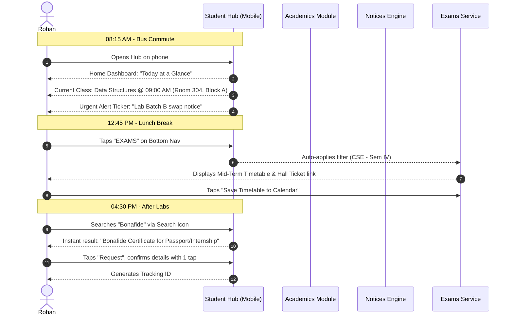
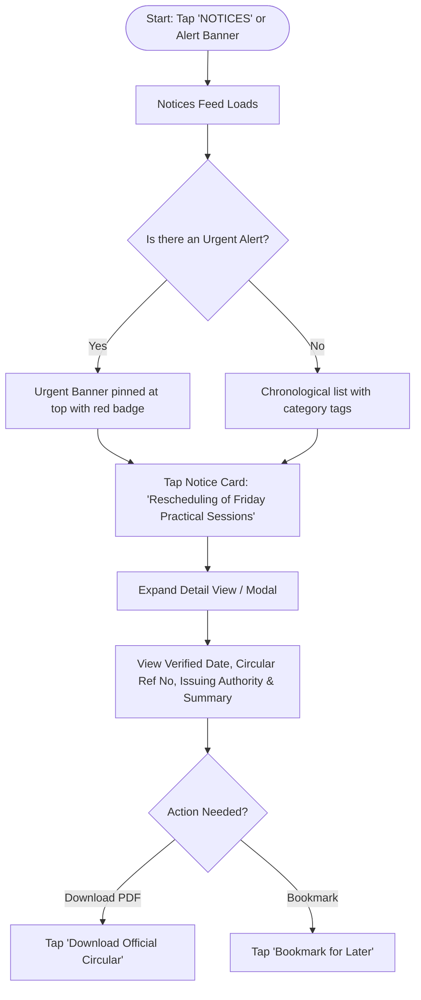
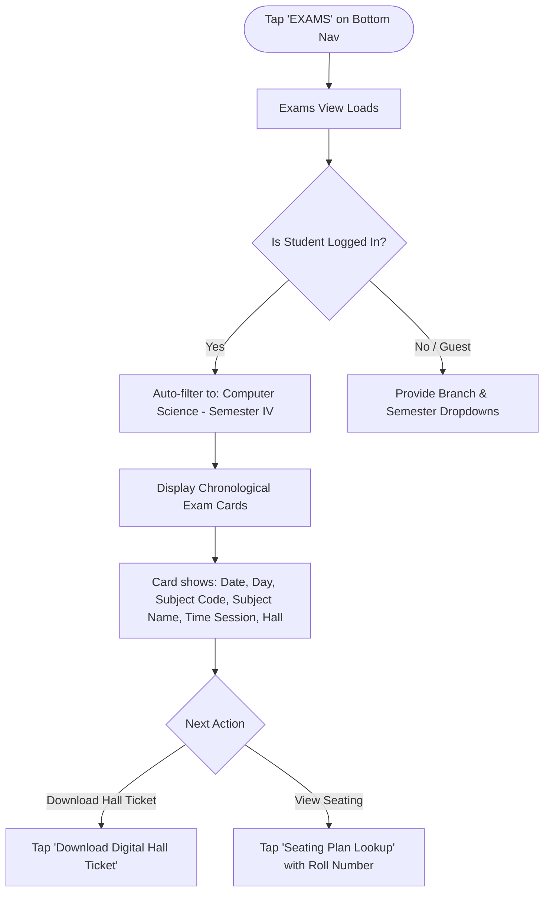
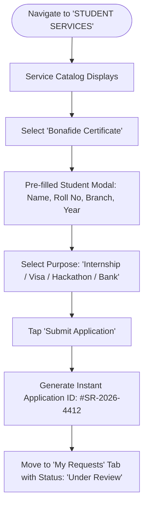
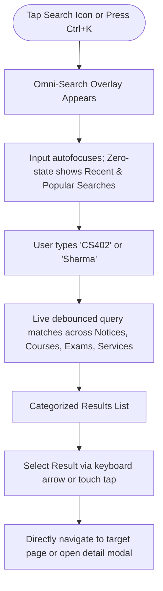

# Mobile-First User Journey & Core Student User Flows

## 1. Persona Narrative: A Day in the Life of Rohan

**Rohan**, 2nd-Year Computer Science & Engineering student (Semester IV).
- **Primary Device:** 6.1" Android smartphone on campus Wi-Fi and 4G.
- **Mental State:** Busy, multi-tasking between classes, assignments, and commute.
- **Goal:** Get accurate academic information instantly without getting bogged down in institutional bureaucracy.



---

## 2. Core User Flows

### Flow 1: Finding Latest Notices & Verifying Schedule Changes

**Trigger:** Rohan hears a campus rumor that Friday classes are suspended due to university sports selections.
**Goal:** Verify authenticity, view official circular, and know if his lab session is affected.



- **Touchpoints & Micro-interactions:**
  - Active category chips (`[All]`, `[Urgent]`, `[Exams]`, `[Academics]`).
  - Tactile spring scale effect on card tap (`scale(0.98)`).
  - Clear "Verified Official" seal badge with date and issuing authority signature indicator.
  - Zero-latency expand drawer with accessible close button (`Esc` key or swipe down).

---

### Flow 2: Checking Today's Class Timetable & Room Number

**Trigger:** Rohan exits the college canteen at 10:55 AM and needs to know where his 11:00 AM lecture is.
**Goal:** Check subject name, room number, building, and faculty in $< 5$ seconds.

```mermaid
graph TD
    A([Rohan opens Student Hub on Mobile]) --> B[Home Dashboard Loads]
    B --> C['Today at a Glance' Widget]
    C --> D{Is a class active now?}
    D -- Yes --> E[Display 'NOW: CS402 Operating Systems - Room 204']
    D -- No / Between Classes --> F[Display 'NEXT UP (11:00 AM): CS403 Database Systems - Room 310']
    E --> G[Tap 'View Full Day Schedule']
    F --> G
    G --> H[Slide-down Day Matrix showing Periods 1 to 6 with faculty names]
```

- **Ergonomics & Edge Cases:**
  - Weekends or holidays automatically display: *"No classes scheduled today. Campus library open 9 AM - 6 PM."*
  - Lab sessions span 2-period blocks with clear batch division (`Batch A1 / A2`).
  - Direct link on the room number triggers campus building map coordinates.

---

### Flow 3: Accessing Mid-Term & Semester Exam Timetable

**Trigger:** Examination dates are announced; Rohan needs his specific exam dates and hall ticket.
**Goal:** Get filtered exam timetable without wading through civil, mechanical, or electrical schedules.



- **Safety & Error Handling:**
  - Clear visual indicator for "Morning Session (09:30 AM - 12:30 PM)" vs "Afternoon Session (02:00 PM - 05:00 PM)".
  - Prominent countdown indicator for the immediate next exam: *"Next Exam: CS401 in 4 days"*.
  - Offline availability hint: Allows caching or downloading printable PDF timetable.

---

### Flow 4: Checking Semester Results & Academic Standing

**Trigger:** University declares Semester III results.
**Goal:** Check marks breakdown, SGPA, and cumulative CGPA without site crash or confusion.

```mermaid
graph TD
    A([Navigate to 'EXAMS' -> 'Results' Tab]) --> B[Results Screen Opens]
    B --> C[Enter Roll Number / Auto-filled from Profile: '24CS084']
    C --> D[Tap 'Fetch Results']
    D --> E{Result Found?}
    E -- Yes --> F[Display Academic Result Card]
    F --> G[Headline: SGPA 8.42 | Status: PASSED (ALL CLEARED)]
    G --> H[Subject-wise Table: Code, Subject, Internal, External, Total, Grade]
    G --> I[Action: Download Official Grade Sheet]
    E -- No / Invalid --> J[Display Clear Error with Helpdesk Link]
```

---

### Flow 5: Submitting a Student Service Request (e.g., Bonafide Certificate)

**Trigger:** Rohan needs an official Bonafide Certificate for an off-campus hackathon or internship.
**Goal:** Request document digitally, receive tracking number, and download when approved.



---

### Flow 6: Universal Omni-Search (`Ctrl+K` / Search Tap)

**Trigger:** Rohan needs the cabin number of Professor Sharma or the syllabus of CS404.
**Goal:** Type query and jump directly to the target record in $< 3$ seconds.



---

## 3. Micro-Interactions & State Matrix

| Interaction | Trigger | Visual Feedback | Transition Timing |
|---|---|---|---|
| **Tab Switch (Bottom Nav)** | Pointer down on icon | Icon scales slightly, accent active indicator slides into position, previous view fades out | 150ms ease-out spring |
| **Card Tap** | Touch / Click on card | Background highlights, scale down to 0.98 | 100ms instant response |
| **Notice Urgent Alert** | Page load | Subtle glowing amber pulse on tag, high-contrast readable banner | Continuous gentle pulse (respecting `prefers-reduced-motion`) |
| **Search Open** | Tap search or `Ctrl+K` | Backdrop blur dims background; search modal slides down from top | 200ms cubic-bezier(0.16, 1, 0.3, 1) |
| **Filter Selection** | Tap category pill | Active pill inverts background to deep primary color, unselected pills dim | 120ms ease-in-out |
