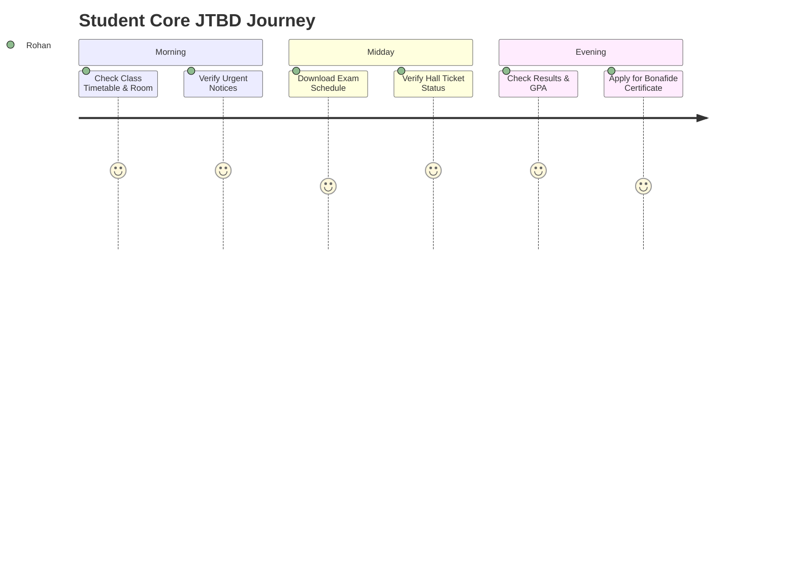

# UX Research & Cognitive Foundations: Student-First Digital Hub

This document establishes the empirical, cognitive, and ergonomic foundations for the redesign of the college website into a student-first digital hub. Every design choice is anchored in established Human-Computer Interaction (HCI) research, explicitly distinguishing between verified **Evidence**, contextual **Assumptions**, and testable **Design Hypotheses**.

---

## 1. Research-Backed UX Principles & Cognitive Science

### 1.1 Information Findability & Progressive Disclosure

- **[Evidence]**:
  - *Nielsen Norman Group (NN/g)* research demonstrates that users do not read web pages word-for-word; they scan in F-shaped or layer-cake patterns searching for visual anchors, headings, and bold keywords.
  - *Hick's Law* ($RT = b \cdot \log_2(n + 1)$) states that the time required to make a decision increases logarithmically with the number and complexity of choices. Presenting uncurated lists of 40+ departmental links on a homepage slows decision time and increases bounce rates.
  - *Miller's Law* establishes working memory constraints (capacity of $7 \pm 2$ chunks), highlighting the danger of high item counts in flat navigation bars.
- **[Assumptions]**:
  - Rohan has an immediate task in mind 90% of the time he visits (e.g., "Check tomorrow's timetable" or "Look up exam date"), rather than browsing casually for entertainment.
  - Exposure to long unstructured administrative text blocks leads students to abandon official pages for peer messaging groups.
- **[Design Hypotheses]**:
  - Structuring the dashboard around the student's *Immediate Context* (Current Class, Next Class, Urgent Deadlines) reduces information retrieval time from >120 seconds on legacy sites to <15 seconds.
  - Using progressive disclosure (showing summary cards with expandable details or targeted "View Details" drawers) will keep visual density low while providing immediate access to comprehensive data.

---

### 1.2 Information Scent & Information Foraging Theory

- **[Evidence]**:
  - *Information Foraging Theory (Pirolli & Card, 1999)* asserts that human users act like optimal foragers in nature, following "information scents" (labels, cues, iconography) that predict the proximity of valuable information. If a link has weak scent (e.g., "Dean's Secretariat" or "Resources"), users perceive a high energy cost and drop off.
  - According to NN/g research on intranet navigation, task-oriented descriptive labels outperform institutional / departmental hierarchy labels by over 300% in first-click success rates.
- **[Assumptions]**:
  - Students do not understand or care which specific administrative office issues a circular (e.g., whether the Controller of Examinations or the Registrar signed off on a schedule change); they simply want to know *"When is the exam?"*.
- **[Design Hypotheses]**:
  - Renaming bureaucratic sections into unambiguous student-first labels (`NOTICES`, `ACADEMICS`, `EXAMS`, `STUDENT SERVICES`) will yield a first-click navigation accuracy >85%.
  - Highlighting categorical badges (e.g., `[EXAM]`, `[URGENT]`, `[HOLIDAY]`, `[SCHOLARSHIP]`) directly next to titles strengthens scent and accelerates scanning.

---

### 1.3 Navigation Hierarchy & Shallow vs. Deep Trees

- **[Evidence]**:
  - Research in HCI (Larson & Czerwinski, CHI 1998) shows that moderately broad, shallow navigation structures (2 levels deep, 6–8 primary categories) consistently outperform deep, narrow structures (4+ levels deep) in task success and mental model stability.
  - The traditional "3-Click Rule" is a proven myth; users do not mind clicking 4 or 5 times if every step provides progressive scent. However, wasted clicks without scent induce rapid frustration and exit.
- **[Assumptions]**:
  - A maximum navigation depth of 2 levels (e.g., `Exams` $\rightarrow$ `Semester IV Timetable`) is sufficient to serve 95% of frequent student tasks.
- **[Design Hypotheses]**:
  - Placing primary categories within persistent top/bottom navigations and limiting child views to dedicated filterable lists will eliminate navigation dead ends and eliminate the need for nested sub-sub-menus.

---

### 1.4 Search UX & Universal Command Access

- **[Evidence]**:
  - According to NN/g search usability benchmarks, search behavior divides users into "search-first" and "browse-first" cohorts (~50/50 distribution in utility portals).
  - Search fails when: (a) it requires exact spelling/syntax, (b) it returns thousands of unranked PDF matches without date context, (c) it lacks zero-state recent search suggestions.
- **[Assumptions]**:
  - Students search for subject codes (e.g., "CS402"), faculty surnames ("Sharma"), common service terms ("bonafide", "hall ticket"), and dates ("mid-term").
- **[Design Hypotheses]**:
  - Providing an instant Omni-Search overlay accessible via keyboard shortcut (`Cmd/Ctrl+K` or header tap) with real-time categorized results (Notices, Exams, Services, Faculty) will resolve high-intent student queries in under 5 seconds.

---

### 1.5 Mobile-First Ergonomics & The Thumb Zone

- **[Evidence]**:
  - *Steve Hoober's mobile ergonomics research* (43,000+ observed mobile users) reveals that 75% of mobile interactions rely on a single thumb, and 49% of users interact one-handed.
  - The bottom 40% of the mobile screen represents the "Natural" thumb comfort zone; the top 20% is the "Hard" stretch zone.
  - *WCAG 2.2 Criterion 2.5.8 (Target Size - Minimum)* mandates a target size of at least $24 \times 24$ CSS pixels, while Apple Human Interface Guidelines and Google Material Design recommend $44 \times 44$ to $48 \times 48$ CSS pixels for primary touch targets.
- **[Assumptions]**:
  - Over 80% of Rohan's visits occur while walking on campus, standing on buses, or between classrooms, where one-handed thumb interaction is dominant.
- **[Design Hypotheses]**:
  - Anchoring primary navigation (`HOME`, `NOTICES`, `ACADEMICS`, `EXAMS`, `SERVICES`) in a persistent bottom navigation bar on viewports $<768\text{px}$ will minimize hand strain and speed up switching between primary hubs.
  - All interactive buttons and list rows will maintain a minimum target height of $44\text{px}$ with at least $8\text{px}$ touch separation.

---

### 1.6 Accessibility (WCAG 2.2 Level AA)

- **[Evidence]**:
  - 15% of the global population experiences some form of temporary or permanent disability (visual, motor, cognitive, situational).
  - WCAG 2.2 Level AA requires:
    - Minimum contrast ratio of 4.5:1 for normal text and 3:1 for large text / graphical user interface components (Criterion 1.4.3 / 1.4.11).
    - Visible, high-contrast keyboard focus indicators (Criterion 2.4.7 & 2.4.11).
    - Meaningful sequential navigation ordering (`tabindex="0"`, logical DOM order) (Criterion 2.4.3).
    - Live region announcements for dynamic alert updates (`aria-live="polite"` or `"assertive"`) (Criterion 4.1.3).
- **[Assumptions]**:
  - Students frequently view the portal outdoors under direct midday sunlight, demanding robust color contrast far exceeding baseline minimums (targeting $\ge 7:1$ for body copy).
- **[Design Hypotheses]**:
  - Adhering to a curated semantic color token system with deep slate backgrounds, crisp neutral cards, and high-contrast sapphire/emerald accents will eliminate legibility failure in outdoor environments.

---

### 1.7 Notification Prioritization & Mitigating Alert Fatigue

- **[Evidence]**:
  - Cognitive psychology demonstrates that alert overload causes habituation: when everything is marked "URGENT", students ignore all alerts.
  - Clear semantic tiering (Critical / Urgent vs. Academic Schedule vs. Informational / Campus Event) preserves student attentiveness.
- **[Assumptions]**:
  - Truly urgent notices (e.g., unexpected severe weather closure, postponed university exam) happen only 1–2 times per month, while routine departmental circulars happen daily.
- **[Design Hypotheses]**:
  - Implementing a 3-tier notification classification system:
    1. **Tier 1 (Urgent/Emergency):** Amber/Red banner fixed to the dashboard top with explicit date and impact badge.
    2. **Tier 2 (Academic Action):** High-priority notice cards with countdown/action badges.
    3. **Tier 3 (General):** Standard chronological feed item.

---

### 1.8 Reducing Cognitive Overload

- **[Evidence]**:
  - Sweller's Cognitive Load Theory identifies three forms of load: *intrinsic* (difficulty of the material itself), *germane* (processing information to build mental schemas), and *extraneous* (mental effort wasted on poor design, visual noise, or confusing navigation).
- **[Assumptions]**:
  - College students already experience significant cognitive fatigue from coursework, exams, and project deadlines.
- **[Design Hypotheses]**:
  - Removing all extraneous visual clutter (flashy animated marketing carousels, dense PDF embeds, decorative stock photo walls) and presenting clean, structured data tables and cards will lower extraneous cognitive load, enabling instant comprehension.

---

## 2. Primary Student Jobs-To-Be-Done (JTBD)

### Detailed JTBD Matrix

| Job Code | Job Statement | Context & Trigger | Current Workaround (Legacy) | Desired Solution (New Hub) |
|---|---|---|---|---|
| **JTBD-1** | When a schedule change or campus alert occurs, I want to find the authentic notice immediately, so that I can plan my day with 100% confidence. | WhatsApp rumor: *"Classes cancelled today?"* | Calling classmates, scrolling through 200 unread messages, opening blurry PDF screenshots. | Pinned Urgent Alert banner on Dashboard + filterable Notice Hub with verified date & stamp. |
| **JTBD-2** | When exam season is announced, I want to find my specific semester timetable and room allocation, so that I prepare on time and arrive at the right exam hall. | Notification from examination cell or class representative. | Navigating 6 nested folders under Registrar to download a 30-page university PDF, then searching for branch. | One-tap access to Exam Hub with Branch & Semester pre-filtered to "CSE - Sem IV". |
| **JTBD-3** | When moving between lectures or arriving on campus, I want to see my class timetable and current room number, so that I don't walk to the wrong classroom. | Rushing between buildings with a 5-minute break. | Saving a screenshot of an Excel sheet to phone gallery, zooming in repeatedly. | "Today's Schedule" widget on Home screen showing current class, next class, room number, and time. |
| **JTBD-4** | When university results are published, I want to view my grades, GPA, and subject breakdown, so that I know my academic standing without site crashes. | Portal announcement that Semester results are live. | Refreshing broken university result portal for 3 hours; dealing with cryptic error codes. | Instant Results viewer with clear GPA/CGPA summary, subject breakdown, and print-ready card. |
| **JTBD-5** | When looking for campus life opportunities, I want to browse upcoming events, hackathons, and seminars, so that I can participate and upskill. | Weekend or after-hours planning. | Stumbling upon expired posters taped to campus pillars. | Interactive Campus Hub with categorized events, dates, venue tags, and calendar reminders. |
| **JTBD-6** | When assignments or fee payments are approaching, I want to see all impending deadlines in one place, so that I avoid late penalties or hall ticket withholding. | Fear of missing critical administrative or academic milestone. | Multiple scattered spreadsheets, LMS deadlines, physical noticeboard notes. | Unified Deadlines Card on Dashboard with countdown indicators (e.g., "Due in 3 days"). |
| **JTBD-7** | When I need an official document (bonafide, transcript, fee receipt), I want to submit a service request digitally, so that I do not spend hours waiting outside administrative counters. | Internship application requires bonafide certificate. | Standing in physical queue at Academic Section for 45 minutes; waiting days for paper signatures. | Digital Student Services catalog with one-click request submission and live tracking status. |
| **JTBD-8** | When I need any information (faculty email, syllabus, library timings), I want to search and get instant matching items, so that I do not have to hunt across pages. | Specific high-intent lookup during study session. | Blindly clicking navigation menus or using Google search with poor indexing. | Global Command Bar / Omni-Search (`Cmd/Ctrl+K`) with instant keyboard and touch suggestions. |

---

## 3. Measurable UX Success Criteria

To rigorously validate the design and confirm that the redesign meets user needs, the following quantitative and qualitative metrics are established:

| Metric Category | Target Benchmark (Legacy Site) | Target Benchmark (New Hub) | Measurement Method |
|---|---|---|---|
| **Time to Find Information (TFI)** | $> 120$ seconds (median) | $< 15$ seconds (median) | Usability testing task timing for key tasks (Exam schedule, Timetable, Urgent notice). |
| **Task Completion Rate (TCR)** | $58\%$ for mobile users | $\ge 95\%$ for mobile users | Unmoderated remote testing across 20 representative student participants. |
| **Navigation Depth** | 4 to 6 clicks/taps with dead ends | $\le 2$ taps for 90% of top student tasks | Information Architecture depth audit and telemetry clickstream. |
| **Search Success Rate** | $< 35\%$ first-query success | $\ge 90\%$ first-query success | Search analytics logging query-to-click conversion and zero-result rates. |
| **Perceived Clarity & SUS** | System Usability Scale (SUS) $< 42$ (Failing) | System Usability Scale (SUS) $\ge 82$ (Top 10% / Grade A) | Standardized 10-item SUS post-test questionnaire. |
| **Accessibility Compliance** | Multiple critical failures (WCAG 1.4.3, 2.4.7) | $100\%$ WCAG 2.2 Level AA compliance | Automated Axe-Core audit + manual keyboard navigation and screen reader testing. |
